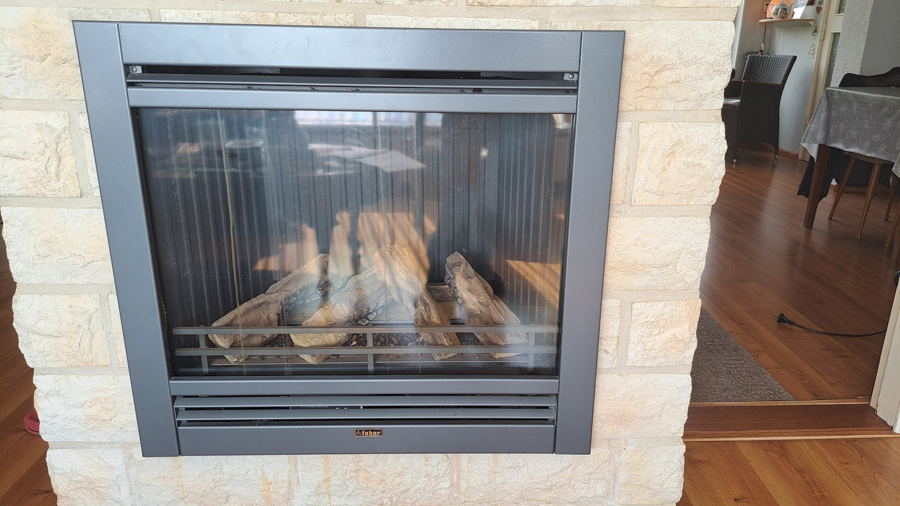

# esphome-PelletStove

This repository is dedicated to documenting the communication and controls of the pellet stove my mother bought recently (september 2024).

I am going to be a parasite and feed on the work of someone else: https://github.com/jazzmonger/wood-pellet-stove-with-TYWE1S-Tuya-chip. Read his [discussions section](https://github.com/jazzmonger/wood-pellet-stove-with-TYWE1S-Tuya-chip/discussions), they are AWESOME! Many, many, many thanks in advanced.

## The story

  
In short: the gas fireplace was replaced with a used pellet stove.

  
My mother (80+) and father (70+) were really happy with their gas stove.

They enjoyed the warmth and liked turning the heat up to more then 22°C, as most elderly people do.

I remember I always had a hard time staying awake in these temperatures in winter times.

But then the war in Ukrain broke loose and gas prices went up in the Netherlands. My parents were shocked by the news reports about the high gas prices and decided to stop turning on the gas fireplace to lower their monthly costs.

In basis that was a really good decision, if it were not for the fact that their 1960's house was not that nicely isolated.

Their next decision was to stop heating around 18h and heat only the living room with an electric heater up to 19°C. My mother also bought a cordless electric heating cushion for her back.

It was kind of okay for them, with some amount of complaining by my mother. She wore several layers of clothing and still was not comfortable.

I then decided to look for an alternative for their unused gas fireplace, but was limited by the fact that they absolutely did not want to invest thousands of Euros in a new fireplace. As they stated: they were too old for such an investment.

So the search was for a used pellet stove, that would fit the hole in the wall.

It took me more then a year to find one with an acceptable price. My father died during my search, so he was not going to benefit from it anymore.

Then I found one, the price was okay. The seller did not know of a manufacturer or model number. The gamble was on me to risk the money of someone else. 

The seller was nice and told us he had a good history with this stove. The reason for him to sell it was that it was getting too hot in his home. In my opinion that was not going to be an issue at my mothers place.

The device was demo-ed and we took it home.

## The 'new' pellet stove

We bought a HY IN9A. Probably this is a rebranded device sold by the company 'Justfire' in the Netherlands.

When Google-ing the model name, this led us to the site [http://histove.com](http://histove.com/?AirPelletStove/51.html). The manufacturing company (I assume) is HAINING HEYING HEATING TECHNOLOGY CO., LTD.

### Site Model information

Model: **HY-IN9A**

Capacity: _9KW_

Description: 2019 newly designed European style insert wood pellet stove

| Product parameters(HY-IN9A) |                 |
|-----------------------------|-----------------|
| Heat Area                   | 100㎡            |
| Dimension(W\*H\*D)          | 807\*635\*621mm |
| Air input pipe              | 50mm            |
| Air outlet pipe             | 80mm            |
| Auto-burning Time           | 13h-27h         |
| Consumption for pellet      | 0.8-1.8kg/h     |
| Efficiency                  | 90%             |
| Hopper Capacity             | 23kg            |
| Electronic comsuotion       | 100-400W/h      |
| Rating voltage              | 230v            |

Specifications:

1. Outside: steel coating.
2. Inside: monobloc steel structure, hand welded, heat-resistant up to 1200°C.
3. Door: carbon steel, high temperature resistant, with glass-ceramic.
4. Removable ash box: it collects the ash fallen through the holes in the brazier.
5. Glass-self cleaning: designing wind to blow ash from the glass keeps the glass always cleaning.
6. LCD control panel: it is placed on the upper side of the stove, simple and easy to be used. It is possible to plan the weekly switching on and off of the stove (week-end included).
7. Thermostat: The stove can keep the room's temperature stably. The temperature can be selected by users both on the panel and remote control, showing on the display.
8. Five steps power setting: it is up to your need, which also shows on the display.
9. Remote control
10. Smoke outlet: ø 80 mm, inlet ø 50 mm
11. Electrical supply: 230V-50Hz. 115V-60HZ, 100V-50HZ

### Not entirely true

As one can read, the information provided is mostly correct. So that is a starting point.

### Image search

So I tried to image search the stove I bought and there were several options:

- It is sold as a [Justfire PS-15-5 BUILDIN](https://justfire.nl/pellethaard-9kw-standard-type-black-2500.html)
- It is a Nemaxx stove (once sold in Germany)
  - The Nemaxx P6 is **identical** to the HY 6A.
- Cleveland Ironworks stove.
  - Their model [No.215](https://www.cleveland-ironworks.com/no-215-mini-pellet-stove.html) really looks like the same HY 6A.

## First basic maintenance

Getting spare parts is not 'cheap'

I am by no means a pellet stove expert. Let me get this out first.

What I am is a technical person. Problem solving is my job and I really like making things simple.

So I used my ash-vacuum-cleaner and take a deeper look into it.

The stove was almost clean, with some sealings ruptured.

Then I asked the company Justfire for a maintenance quote, and their response was this:

- Incidental maintenance: €300,-
- the mainboard (MCU) would need replacement because of a fire hazard: €200,-
- the display would need to match the MCU and would also be replaced: €170,-
- the ruptured seals would probably be included in the maintenance, if not that would add another €80,-

**No way that I am going to pay €750,-** for a first maintenance and inspection. They did not ask me for any serial number, model number, date of manufacturing or anything else.

I investigated other sellers for just the sealing-replacements than Justfire, but was unable to find all the seals that I needed. So I paid €80,- for two sealings at Justfire. These I can replace myself easily.

Half an hours of vacuuming, brushing and replacing the seals and we are in business for now.

### Spare parts

I will list all the parts I buy and/or replace in [parts-list.md](./parts-list.md).

### The missing remote

Unable to find a replacement remote control

I found out the stove should have a remote. This would be nice so my mother would not need to bend over to control the stove.

I was unable to find a replacement remote for a price less then €80,-. That is too much as far as I am concerned. No guarantees that the remote would work anyway.

Justfire also sells a WiFi module for the ginormous amount of €160,-. But for an extra €160,- they are willing to configure it for me 😄.

### And then I found the jazzmonger github repository

When I found the [Github repository of Jazzmonger](https://github.com/jazzmonger/wood-pellet-stove-with-TYWE1S-Tuya-chip) I was overwhelmed with his work and enthousiasm. Wow!

I already have an [HomeAssistant](https://www.home-assistant.io/) instance at my mothers house, to monitor gas usage and room temperatures. It would really be a nice addition to connect the stove to it.

What I would really like to accomplish is:

- Be able to remotely control the stove from HomeAssistant
  - Turn it on/off
  - change the ECO mode
  - change the P1-4 modes
  - be able to measure temperatures
  - reading the stove 'states'
  - detect and reset errors
- All without any 'special' PCBs to buy
  - I mean, I have several ESP32's laying around and I am willing to assemble a PCB of some sort and order material.

But most, if not all, of the heavy lifting has been done by [Jazzmonger](https://github.com/jazzmonger) already.

What I need to do is:

- Understand what he has accomplished, how it works and how to copy/adapt/improve his work.
  - I will be returning to him as I improve. Promised.