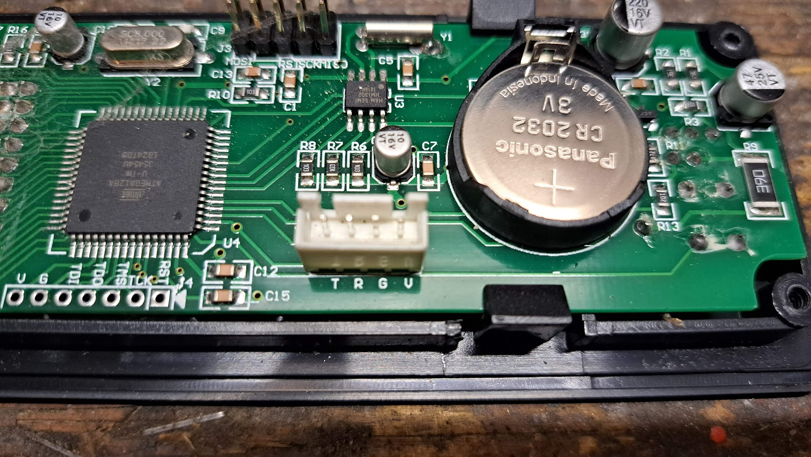
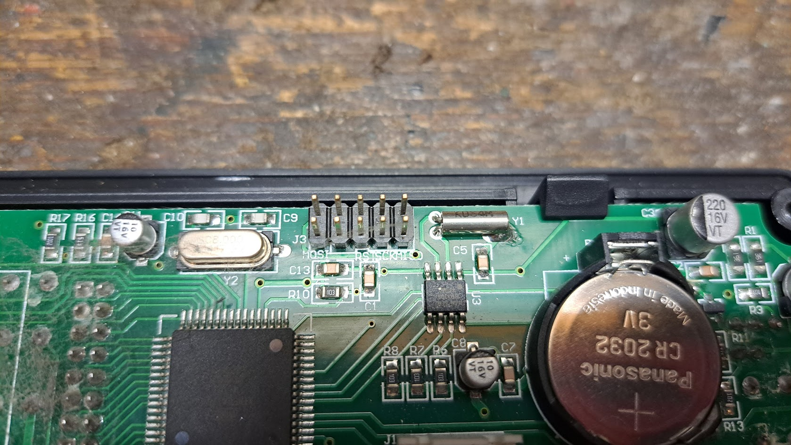

# Display panel pictures

[[_TOC_]]

Model: QNQ1_A_S3

## First pictures

To find out if it had a wireless daughtboard available.  
The answer was: no.

## Replacement display panel

Model: QNQ1_A_S3

THe mainboard had to be replaced. And then I had a firmware mismatch. So I also needed to replace the display board. 😠

