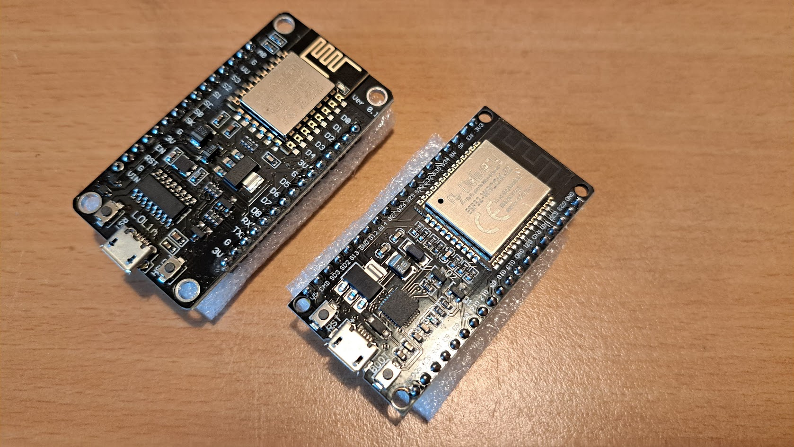
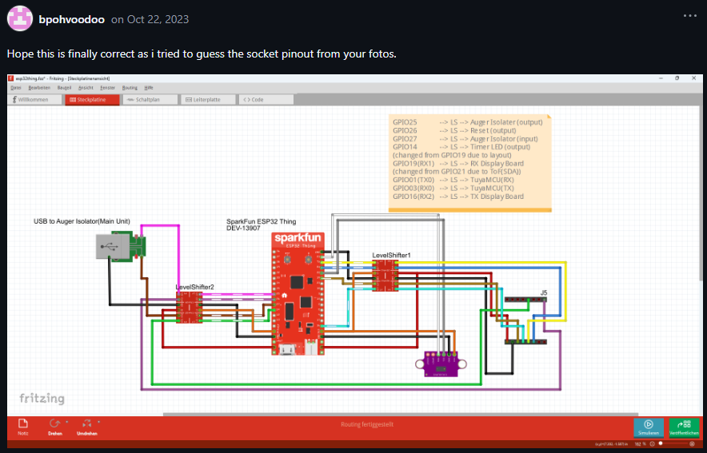

# Connecting the ESP

## ESP - NodeMCU

I have got several ESP devices lying around.

- ESP8266
- ESP32 WROOM32

I will be starting with the ESP32 device.

[Jeff](https://github.com/jazzmonger) [reacted enthousiasticly](https://github.com/jazzmonger/wood-pellet-stove-with-TYWE1S-Tuya-chip/discussions/37) on my intentions.

I will be starting with his basic setup.

## Additional parts

As far as I can see, the only additional parts I need right now are level shifters.

So that would be

- https://www.tinytronics.nl/en/communication-and-signals/level-converters/txs0108e-spi-i2c-uart-bi-directionele-logic-level-converter-8-channel
- https://www.tinytronics.nl/en/communication-and-signals/level-converters/spi-i2c-uart-bi-directional-logic-level-converter-4-channel

Pellet level sensor

- TOF sensor- VL53L0X - https://www.tinytronics.nl/en/sensors/distance/vl53l0x-time-of-flight-tof-distance-sensor
  - of VL53L1X? - https://www.tinytronics.nl/en/sensors/distance/vl53l1x-time-of-flight-tof-distance-sensor

What would be really nice is

- https://www.tinytronics.nl/en/cables-and-connectors/connectors/pin-headers/female/
- https://www.tinytronics.nl/en/cables-and-connectors/connectors/jst-compatible

## Wiring

As far as I can tell from Jeff's github repo I need to wire the following

I am not sure yet where to connect to on the display-device

- 5V power to ESP
- GND to ESP

- UART1 <-> TuyaMCU
  - TX: GPIO3 (tbd) with level shift
  - RX: GPIO1 (tbd) with level shift
- UART2 <- Display message decoding
  - RX: GPIO10 (tbd) with level shift
- UART3 <- main MCU real-time multiple temp decoding
  - RX: GPIO5 (tbd) with level shift

  ### TuyaMCU

  ### Display message

  ## Random

   - https://github.com/jazzmonger/wood-pellet-stove-with-TYWE1S-Tuya-chip/discussions/34#discussioncomment-7352643

