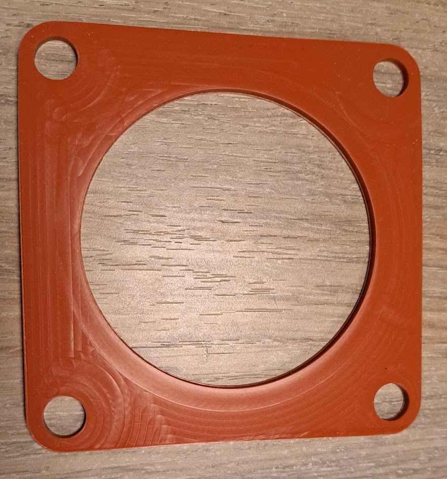

# Parts list

## Exhaust sealing

### Specifications

Pakking voor rookgasavoer

- Binnendiameter: 74 mm
- Buitendiameter: 140 mm
- Maximale temp: 260 gr. Celcius
- Materiaal: HT siliconen
- Kleur: Zwart of Rood

### Sellers

- [Justfire.nl à €60,-](https://justfire.nl/rubber-tbv-uitlaat-flens.html)
- [Pelletkachelonderdelen.eu à €15,-](https://pelletkachelonderdelen.eu/pakkingen/613-rookgasafvoer-pakking-tbv-inbouwpelletkachels-00087061.html)

## Exhaust sealing 2

### Specifications

Size: 107mm x 107mm
Hole diameter: 78,5mm
Mounting hole diameter: 10,5mm

### Sellers

- [Justfire à €20,-](https://justfire.nl/ps-parts-exaustconnection.html)